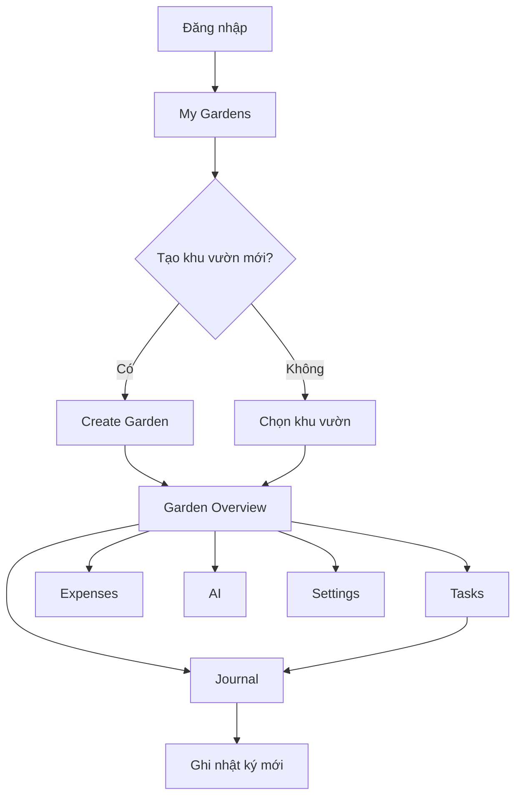

# Garden Module — Product Design

> **Status:** Design document only — no implementation.  
> **Scope:** Garden as the root workspace of FarmGreen.  
> **Audience:** Product, design, and engineering.  
> **Date:** July 2026

---

## 1. Vision

### Garden is the root workspace

FarmGreen is organized around **Gardens** — each garden is a self-contained workspace representing one plot, crop area, or zone on the farm. Everything a farmer does (tasks, journal entries, photos, expenses, harvest records) belongs to a garden.

Today, features are scattered across global routes (`/logs`, `/assistant`, `/diagnose`, `/reports`). The Garden module redesigns FarmGreen so that **the farmer enters a garden first**, then works inside it. Global navigation becomes secondary — a way to switch between gardens or access account-level settings.

```
FarmGreen
└── My Gardens (list)
    └── Garden: "Vườn cà phê A"  ← root workspace
        ├── Overview
        ├── Tasks
        ├── Journal
        ├── Photos
        ├── Expenses
        ├── Harvest
        ├── Inventory
        ├── AI
        └── Settings
```

### Product promise

> *"Mở khu vườn → biết ngay hôm nay cần làm gì → ghi lại công việc → theo dõi chi phí và sản lượng."*

Open a garden → know what to do today → log the work → track costs and yield.

### Design principles


| Principle                   | Meaning for Garden                                                       |
| --------------------------- | ------------------------------------------------------------------------ |
| **Garden-first**            | User picks a garden before doing farm work                               |
| **One question per screen** | Overview answers "what's the status?"; Tasks answers "what should I do?" |
| **Mobile-first**            | Designed for 375px viewport, outdoor use, gloved hands                   |
| **Vietnamese-first**        | All labels, empty states, and errors in Vietnamese                       |
| **Progressive disclosure**  | MVP ships core tabs; future tabs appear when data exists                 |
| **No auto-AI**              | AI tab requires explicit user action (button press)                      |
| **Simple over smart**       | Heuristic reminders before complex scheduling engines                    |


### Relationship to existing app


| Current state                                | Garden module direction                                            |
| -------------------------------------------- | ------------------------------------------------------------------ |
| `/gardens` — flat card list with add/delete  | Evolves into **My Gardens** hub with richer cards                  |
| `/gardens/:gardenId/logs` — log history only | Becomes **Journal** tab inside garden workspace                    |
| `/logs/new` — global log form                | Moves to **Journal → Ghi nhật ký** inside a garden                 |
| `/logs` — all logs across gardens            | Remains as optional **global view** (secondary)                    |
| Dashboard `/` — farm-wide summary            | Becomes **multi-garden overview** or redirects to last-used garden |
| AI, diagnose, reports — global sidebar items | Consolidated into per-garden **AI** tab                            |


---

## 2. User Flow

### 2.1 First-time user

```
Đăng nhập
  → My Gardens (empty)
    → "Thêm khu vườn đầu tiên"
      → Create Garden form
        → Garden Overview (new garden, empty state)
          → Prompt: "Ghi nhật ký hoạt động đầu tiên"
```

**Goal:** User creates one garden and logs one activity within 2 minutes.

### 2.2 Daily morning flow (returning user)

```
Mở app
  → Last-used Garden → Overview
    → Xem tóm tắt hôm nay (tasks, weather snippet, last activity)
    → Chuyển sang Tasks → xem việc cần làm
    → Làm việc trên ruộng
    → Journal → Ghi nhật ký (1 tap từ Overview CTA)
```

**Goal:** Answer "hôm nay khu vườn này cần gì?" in under 10 seconds.

### 2.3 Multi-garden farmer

```
My Gardens
  → Chọn "Vườn rau B"
    → Overview → Tasks → Journal
  → Quay lại My Gardens (header back or garden switcher)
  → Chọn "Vườn cà phê A"
    → Tiếp tục công việc
```

**Goal:** Switch gardens in 2 taps. No confusion about which garden is active.

### 2.4 End-of-day review

```
Garden → Expenses
  → Xem chi phí hôm nay / tuần này
Garden → Journal
  → Xem lại nhật ký đã ghi
Garden → Photos (future)
  → Xem ảnh ghi nhận trong ngày
```

### 2.5 AI-assisted flow

```
Garden → AI
  → Chọn hành động: "Phân tích khu vườn" / "Hỏi về cây trồng" / "Chẩn đoán bệnh"
  → Bấm nút (không tự chạy)
  → Xem kết quả trong ngữ cảnh khu vườn
```

AI always knows which garden is active. No need to re-select garden inside AI flows.

### Flow diagram




---

## 3. Navigation

### 3.1 Information architecture

```
Level 0 — Account
  └── Auth, profile, sign out

Level 1 — Farm (My Gardens)
  └── Garden list, create garden, search/filter

Level 2 — Garden Workspace
  └── Overview | Tasks | Journal | Photos | Expenses | Harvest | Inventory | AI | Settings

Level 3 — Actions within tab
  └── e.g. Journal → New entry, Journal → Entry detail
```

### 3.2 Global navigation (app shell)

The current sidebar lists every feature globally. In the Garden module model, the sidebar simplifies:


| Sidebar item              | Role                                                  |
| ------------------------- | ----------------------------------------------------- |
| **Khu vườn**              | Primary — opens My Gardens list                       |
| **Tổng quan nông trại**   | Optional farm-wide dashboard (all gardens aggregated) |
| **Tài khoản / Đăng xuất** | Account actions                                       |


Weather, AI assistant, diagnose, and reports **move inside each garden** rather than appearing as top-level sidebar items. This reduces cognitive load: the farmer thinks in terms of "my coffee garden" not "the AI module."

### 3.3 Garden workspace navigation

Inside a garden, use a **horizontal tab bar** (mobile) or **sub-navigation** (desktop):

```
┌─────────────────────────────────────────────────────────┐
│  ← Khu vườn          Vườn cà phê A          ⋮           │
├─────────────────────────────────────────────────────────┤
│ Tổng quan │ Việc │ Nhật ký │ Ảnh │ Chi phí │ ... │ AI  │
├─────────────────────────────────────────────────────────┤
│                                                         │
│                   [Tab content]                         │
│                                                         │
└─────────────────────────────────────────────────────────┘
```

**Tab order (left to right):**


| #   | Tab (VI)     | Tab (EN key) | MVP priority                               |
| --- | ------------ | ------------ | ------------------------------------------ |
| 1   | Tổng quan    | Overview     | P0 — MVP                                   |
| 2   | Việc cần làm | Tasks        | P0 — MVP                                   |
| 3   | Nhật ký      | Journal      | P0 — MVP                                   |
| 4   | Ảnh          | Photos       | P2 — future                                |
| 5   | Chi phí      | Expenses     | P1 — MVP (aggregate existing `cost` field) |
| 6   | Thu hoạch    | Harvest      | P2 — future                                |
| 7   | Kho          | Inventory    | P3 — future                                |
| 8   | AI           | AI           | P1 — consolidate existing AI features      |
| 9   | Cài đặt      | Settings     | P0 — MVP (edit garden, delete)             |


**Overflow on mobile:** Show first 4 tabs + "Thêm" menu for remaining tabs. On tablet/desktop, show all tabs or use scrollable tab bar.

### 3.4 Route structure (proposed)


| URL                              | Page                                          |
| -------------------------------- | --------------------------------------------- |
| `/gardens`                       | My Gardens list                               |
| `/gardens/new`                   | Create garden (optional — can stay as dialog) |
| `/gardens/:gardenId`             | Garden Overview (default tab)                 |
| `/gardens/:gardenId/tasks`       | Tasks                                         |
| `/gardens/:gardenId/journal`     | Journal list                                  |
| `/gardens/:gardenId/journal/new` | New journal entry                             |
| `/gardens/:gardenId/photos`      | Photos gallery                                |
| `/gardens/:gardenId/expenses`    | Expenses summary                              |
| `/gardens/:gardenId/harvest`     | Harvest records                               |
| `/gardens/:gardenId/inventory`   | Inventory                                     |
| `/gardens/:gardenId/ai`          | AI hub                                        |
| `/gardens/:gardenId/settings`    | Garden settings                               |


Existing `/gardens/:gardenId/logs` maps to `/gardens/:gardenId/journal` (redirect or alias during migration).

### 3.5 Garden switcher

Persistent garden context indicator in the workspace header:

- **Garden name** + crop badge
- Tap name → opens garden switcher sheet (bottom drawer on mobile)
- Shows all gardens with quick stats (last activity, pending tasks count)

### 3.6 Breadcrumbs

Keep navigation shallow. Maximum depth: 3 levels.

```
Khu vườn → Vườn cà phê A → Nhật ký → Chi tiết
```

Use back arrow (`←`) on mobile instead of full breadcrumb trail.

---

## 4. Garden Pages

### 4.1 My Gardens (`/gardens`)

**Purpose:** Entry point. Farmer sees all gardens and picks one to work in.

**Content:**

- Page title: "Khu vườn"
- Subtitle: "Chọn khu vực canh tác để bắt đầu"
- Grid of garden cards (see Section 5)
- FAB or header button: "Thêm khu mới"
- Empty state when no gardens exist

**Actions:**

- Tap card → enter garden workspace (Overview)
- Long-press card (mobile) → quick actions menu (Ghi nhật ký, Xem việc)
- Swipe card (future) → archive or delete

**Not on this page:** Detailed logs, expenses charts, AI chat. Keep it a clean picker.

---

### 4.2 Overview (`/gardens/:gardenId`)

**Purpose:** Single-screen status of this garden. Answers "khu vườn này thế nào hôm nay?"

**Sections (top to bottom):**


| Section              | Content                                                          |
| -------------------- | ---------------------------------------------------------------- |
| **Garden header**    | Name, crop badge, area, location, planted date                   |
| **Today's snapshot** | 2–3 task reminders, weather one-liner (if location set)          |
| **Quick actions**    | Primary: "Ghi nhật ký" — Secondary: "Xem việc cần làm", "Hỏi AI" |
| **Recent activity**  | Last 3 journal entries for this garden                           |
| **Mini stats**       | Total logs, total expenses (month), days since planted           |


**Empty state (new garden):**

- Illustration + "Chưa có hoạt động nào"
- CTA: "Ghi nhật ký đầu tiên"

**Does not include:** Full task list, full expense breakdown, photo gallery. Link to tabs instead.

---

### 4.3 Tasks (`/gardens/:gardenId/tasks`)

**Purpose:** What needs attention in this garden today and this week.

**MVP content (heuristic-based, from existing `TodayTasks` logic):**

- Done today (completed journal entries)
- Reminders: watering (3-day), fertilizer (30-day), spray (14-day)
- Warnings: "Chưa có nhật ký nào"

**Task card structure:**

```
┌──────────────────────────────────────┐
│ 💧 Kiểm tra tưới nước                │
│ Lần cuối: 4 ngày trước               │
│              [Ghi nhật ký tưới]      │
└──────────────────────────────────────┘
```

**Future:** User-configurable intervals per crop type, calendar view, push notifications.

**Actions:**

- Tap task → pre-fill journal form with activity type
- Mark as done → creates journal entry (future)

---

### 4.4 Journal (`/gardens/:gardenId/journal`)

**Purpose:** Activity log for this garden. Replaces current `/gardens/:gardenId/logs` and scoped `/logs/new`.

**Content:**

- Filter by activity type (Tưới nước, Bón phân, Phun thuốc, etc.)
- Timeline grouped by date (newest first)
- Each entry: type, date, note, cost badge
- FAB: "Ghi nhật ký"

**New entry form (`/journal/new`):**

- Activity type (select)
- Date (default today)
- Note (textarea)
- Cost (optional, VND)
- Garden pre-filled (not changeable from within garden context)

**Entry detail (future):**

- Full entry view with edit/delete
- Linked photos (when Photos tab exists)

**Maps to existing:** `activity_logs` table, `useFarmStore()`, `useFarmActions()`.

---

### 4.5 Photos (`/gardens/:gardenId/photos`)

**Purpose:** Visual record of the garden — growth progress, disease, harvest quality.

**MVP (future phase):** Placeholder tab with empty state.

**Future content:**

- Grid gallery (chronological)
- Upload from camera or gallery
- Tag photo with journal entry or standalone
- Link to AI diagnose from photo

**Storage:** Supabase Storage bucket, scoped by `user_id` + `garden_id`. RLS enforced.

---

### 4.6 Expenses (`/gardens/:gardenId/expenses`)

**Purpose:** Cost tracking for this garden.

**MVP content (no new schema):**

- Aggregate `cost` from `activity_logs` where `garden_id` matches
- Summary cards: Hôm nay | Tuần này | Tháng này | Tổng
- List of expense entries (journal entries with cost > 0)
- Simple bar by activity type (no complex charts)

**Future:**

- Standalone expense entries (not tied to journal)
- Categories: phân bón, thuốc, nhân công, thuê máy
- Export CSV / Excel

---

### 4.7 Harvest (`/gardens/:gardenId/harvest`)

**Purpose:** Track yield and harvest events.

**MVP (future phase):** Placeholder or basic list of "Thu hoạch" journal entries.

**Future content:**

- Harvest record: date, quantity, unit (kg, tạ, tấn), quality grade, buyer/price
- Season summary: total yield, yield per m²
- Comparison across seasons

**Schema (future):** `harvest_records` table linked to `garden_id`.

---

### 4.8 Inventory (`/gardens/:gardenId/inventory`)

**Purpose:** Track inputs (fertilizer, pesticide, seeds, tools) used on this garden.

**MVP (future phase):** Placeholder tab.

**Future content:**

- Item list: name, quantity, unit, last used date
- Low-stock alerts
- Link inventory usage to journal entries (e.g. "used 2kg NPK")

**Schema (future):** `inventory_items` table, optionally scoped to garden or farm-wide.

---

### 4.9 AI (`/gardens/:gardenId/ai`)

**Purpose:** All AI features in garden context. Consolidates existing `/assistant`, `/diagnose`, dashboard AI.

**Sections:**


| Action             | Description                    | Trigger      |
| ------------------ | ------------------------------ | ------------ |
| Phân tích khu vườn | AI summary of garden status    | Button press |
| Hỏi về cây trồng   | Chat with garden data context  | Button press |
| Chẩn đoán bệnh     | Photo upload → diagnosis       | Button press |
| Tạo báo cáo        | Monthly report for this garden | Button press |


**Rules:**

- Never auto-run on tab open
- Garden context (crop, logs, area) pre-loaded into prompts
- Results displayed inline, not redirected to global pages

**Maps to existing:** `ai.functions.ts`, `diagnoseDisease`, `chatWithAssistant`, `analyzeFarm`.

---

### 4.10 Settings (`/gardens/:gardenId/settings`)

**Purpose:** Edit or remove this garden.

**Content:**

- Edit form: name, crop, area, location, planted date, notes
- Danger zone: Delete garden (with cascade warning for logs)
- Future: crop template, reminder intervals, location coordinates

**Maps to existing:** Fields in `gardens` table. Adds missing `updateGarden` mutation.

---

## 5. Garden Card

The garden card is the primary object on the My Gardens page. It must communicate enough for the farmer to choose the right garden at a glance.

### 5.1 Card anatomy

```
┌─────────────────────────────────────┐
│ ████████████ (green accent bar)     │
│                                     │
│  Vườn cà phê A          [Cà phê]  │
│                                     │
│  📍 Khu A - Sau nhà                 │
│  📐 1.200 m²                        │
│  📅 Trồng: 15/03/2024               │
│                                     │
│  ─────────────────────────────────  │
│  ⚡ 2 việc cần làm    📝 12 nhật ký │
│                                     │
│  [    Mở khu vườn    ]              │
└─────────────────────────────────────┘
```

### 5.2 Card fields


| Field               | Source                              | Required                  |
| ------------------- | ----------------------------------- | ------------------------- |
| Name                | `gardens.name`                      | Yes                       |
| Crop badge          | `gardens.crop`                      | Yes                       |
| Location            | `gardens.location`                  | No (show "—" if empty)    |
| Area                | `gardens.area`                      | Yes (show "0 m²" if zero) |
| Planted date        | `gardens.planted_at`                | Yes                       |
| Pending tasks count | Computed from journal heuristics    | MVP                       |
| Journal count       | Count of `activity_logs` for garden | MVP                       |
| Last activity       | Most recent log date                | Future                    |
| Health indicator    | AI-derived or heuristic             | Future                    |


### 5.3 Card states


| State                    | Visual                                     |
| ------------------------ | ------------------------------------------ |
| **Default**              | White card, green accent bar, hover shadow |
| **Has pending tasks**    | Small orange/warning dot on card           |
| **No activity yet**      | Muted style + "Chưa có nhật ký"            |
| **Selected / last-used** | Subtle green border (future)               |


### 5.4 Card actions


| Action      | Trigger                           | Result                    |
| ----------- | --------------------------------- | ------------------------- |
| Open garden | Tap card or "Mở khu vườn"         | Navigate to Overview      |
| Quick log   | Secondary button or long-press    | Navigate to Journal → New |
| Delete      | Swipe or overflow menu → Settings | Confirm → delete          |


### 5.5 Grid layout


| Viewport            | Columns                    |
| ------------------- | -------------------------- |
| Mobile (< 768px)    | 1 column, full-width cards |
| Tablet (768–1024px) | 2 columns                  |
| Desktop (> 1024px)  | 3 columns                  |


Card minimum height: enough for thumb-friendly tap target (min 120px touch area for primary action).

---

## 6. Mobile UX

FarmGreen users work outdoors on phones. The Garden module must be designed mobile-first.

### 6.1 Layout rules


| Rule                     | Implementation                                          |
| ------------------------ | ------------------------------------------------------- |
| **Thumb zone**           | Primary CTAs at bottom of screen (FAB or sticky footer) |
| **Readable outdoors**    | No `text-xs` for primary content; min 16px body         |
| **Large tap targets**    | Min 44×44px for all interactive elements                |
| **No horizontal scroll** | `overflow-x-hidden` on all garden pages                 |
| **One primary action**   | Each screen has one green CTA, others are outline/ghost |


### 6.2 Garden workspace on mobile

```
┌────────────────────────┐
│ ← Khu vườn  Vườn cà phê│  ← Sticky header
├────────────────────────┤
│ Tổng quan │ Việc │ +  │  ← Scrollable tabs (4 visible + "Thêm")
├────────────────────────┤
│                        │
│   Tab content          │
│   (scrollable)         │
│                        │
│                        │
├────────────────────────┤
│  [  + Ghi nhật ký  ]   │  ← Sticky bottom CTA (on Overview, Tasks)
└────────────────────────┘
```

### 6.3 Gestures


| Gesture         | Action                                 |
| --------------- | -------------------------------------- |
| Tap card        | Open garden                            |
| Pull down       | Refresh garden data                    |
| Swipe back      | Return to My Gardens (browser/history) |
| Long-press card | Quick actions sheet (future)           |


### 6.4 Offline considerations (future)

- Show cached garden data when offline
- Queue journal entries for sync when back online
- Clear "Đang offline" indicator in header
- Disable AI tab when offline (requires server)

### 6.5 Performance on mobile

- Load Overview first; lazy-load other tabs on first visit
- Garden-scoped queries (don't fetch all logs for all gardens on Overview)
- Skeleton loaders for cards and timeline
- Optimistic UI for journal entry creation

### 6.6 Accessibility

- `aria-label` on icon-only buttons (delete, back)
- Focus visible rings on all interactive elements
- Color is not the only indicator (use icons + text for task urgency)
- `lang="vi"` already set at root

---

## 7. Future Scalability

### 7.1 Data model growth

The current schema supports MVP Journal and Expenses. Future tabs require additive migrations:


| Tab       | New table (proposed)         | Links to garden                      |
| --------- | ---------------------------- | ------------------------------------ |
| Photos    | `garden_photos`              | `garden_id`                          |
| Harvest   | `harvest_records`            | `garden_id`                          |
| Inventory | `inventory_items`            | `garden_id` (or farm-wide `user_id`) |
| Tasks     | `garden_tasks`               | `garden_id`                          |
| Settings  | (existing `gardens` columns) | —                                    |


All new tables follow existing RLS pattern: `auth.uid() = user_id`.

### 7.2 Feature flags per tab

Ship tabs incrementally without redesigning navigation:

```
MVP:     Overview, Tasks, Journal, Settings
Phase 2: Expenses, AI
Phase 3: Photos, Harvest
Phase 4: Inventory
```

Hidden tabs can show as "Sắp ra mắt" in the overflow menu, or simply not render until ready.

### 7.3 Multi-garden scale


| Gardens per user | UX consideration                                                  |
| ---------------- | ----------------------------------------------------------------- |
| 1–5              | Card grid, no search needed                                       |
| 6–20             | Add search/filter by crop name                                    |
| 20+              | List view option, sort by last activity, archive inactive gardens |


### 7.4 Crop templates (future)

Settings → "Loại cây trồng" could offer templates:


| Crop      | Default tasks   | Default intervals |
| --------- | --------------- | ----------------- |
| Cà phê    | Tưới, Bón, Phun | 3d / 30d / 14d    |
| Sầu riêng | Tưới, Bón, Phun | 2d / 21d / 10d    |
| Rau       | Tưới, Thu hoạch | 1d / — / 7d       |


Templates pre-configure Tasks tab without user setup.

### 7.5 Collaboration (future)


| Feature                | Design consideration                                      |
| ---------------------- | --------------------------------------------------------- |
| Shared garden          | `garden_members` table with roles (owner, worker, viewer) |
| Worker logs activity   | Journal entry shows who created it                        |
| Owner sees all gardens | My Gardens shows owned + shared                           |


Garden workspace navigation unchanged; permissions gate write actions.

### 7.6 Marketplace / IoT (out of scope, but planned for)

- **Marketplace:** Separate top-level module, links from Harvest tab ("Bán sản phẩm")
- **IoT sensors:** Optional widget on Overview ("Độ ẩm đất: 62%") — does not replace Tasks
- **Weather:** Stays as contextual snippet on Overview; full weather page remains farm-wide

### 7.7 Migration path from current app


| Step | Action                                            | Risk                       |
| ---- | ------------------------------------------------- | -------------------------- |
| 1    | Add `/gardens/:gardenId` Overview route           | Low                        |
| 2    | Redirect `/gardens/:gardenId/logs` → `/journal`   | Low — alias                |
| 3    | Add tab navigation component inside garden layout | Medium                     |
| 4    | Move log creation into garden context             | Medium                     |
| 5    | Add Settings tab with edit garden                 | Low                        |
| 6    | Consolidate AI into garden AI tab                 | Medium — UX change         |
| 7    | Simplify global sidebar                           | Medium — user habit change |
| 8    | Add Photos, Harvest, Inventory tabs               | Low — additive             |


No breaking changes to database schema required for MVP steps 1–5.

---

## Appendix A — Tab Summary


| Tab       | Vietnamese   | MVP | Data source                   | Primary action              |
| --------- | ------------ | --- | ----------------------------- | --------------------------- |
| Overview  | Tổng quan    | ✅   | `gardens` + `activity_logs`   | Ghi nhật ký                 |
| Tasks     | Việc cần làm | ✅   | Heuristics on `activity_logs` | Ghi nhật ký (pre-filled)    |
| Journal   | Nhật ký      | ✅   | `activity_logs`               | Ghi nhật ký mới             |
| Photos    | Ảnh          | 🔜  | `garden_photos` (future)      | Chụp / tải ảnh              |
| Expenses  | Chi phí      | ✅   | `activity_logs.cost`          | Xem chi tiết                |
| Harvest   | Thu hoạch    | 🔜  | `harvest_records` (future)    | Ghi thu hoạch               |
| Inventory | Kho          | 🔜  | `inventory_items` (future)    | Thêm vật tư                 |
| AI        | AI           | ✅   | Server functions              | Phân tích / Hỏi / Chẩn đoán |
| Settings  | Cài đặt      | ✅   | `gardens`                     | Sửa / Xóa khu vườn          |


## Appendix B — Glossary


| Term (VI)    | Term (EN) | Meaning                                         |
| ------------ | --------- | ----------------------------------------------- |
| Khu vườn     | Garden    | A managed plot / crop area — the root workspace |
| Nhật ký      | Journal   | Activity log entry                              |
| Việc cần làm | Tasks     | Reminders and to-dos for a garden               |
| Thu hoạch    | Harvest   | Yield collection record                         |
| Kho          | Inventory | Input supplies (fertilizer, pesticide, seeds)   |


## Appendix C — Related Documents


| Document                                          | Relevance                   |
| ------------------------------------------------- | --------------------------- |
| `[docs/product.md](product.md)`                   | Product goals and personas  |
| `[docs/project-analysis.md](project-analysis.md)` | Current codebase state      |
| `[docs/ui-guideline.md](ui-guideline.md)`         | Visual and layout standards |
| `[docs/database.md](database.md)`                 | Current schema              |
| `[docs/roadmap.md](roadmap.md)`                   | Phase planning              |


